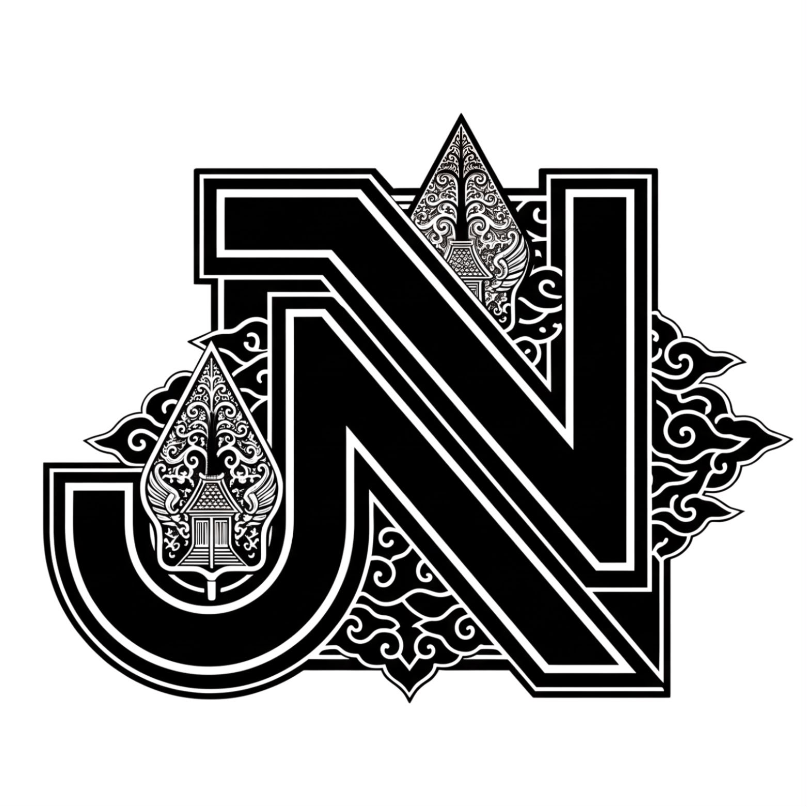

D:\MATKUL\SEMESTER 4\pbl\PortofolioJavasnavasena\stylesheet.css
/* ======================================================= */

@import url('https://fonts.googleapis.com/css2?family=Poppins:wght@300;400;500;600;700;800&display=swap');

/* =======================================================
   RESET
======================================================= */

*{
    margin:0;
    padding:0;
    box-sizing:border-box;
    scroll-behavior:smooth;
    font-family:'Poppins',sans-serif;
}

html{
    overflow-x:hidden;
}

body {
  /* Menggabungkan warna dasar gelap dengan 2 lingkaran pendaran cahaya (biru di kiri bawah, ungu di kanan atas) */
  background: 
    radial-gradient(circle at 10% 70%, rgba(0, 168, 204, 0.25), transparent 45%),
    radial-gradient(circle at 85% 20%, rgba(142, 68, 173, 0.25), transparent 50%),
    #0d0f14; /* Warna dasar abu-abu gelap kehitaman seperti di gambar */
  
  background-attachment: fixed; /* Menjaga gradasi tetap di posisinya saat halaman di-scroll */
  color: #fff;
  overflow-x: hidden;
  min-height: 100vh;
}

/* =======================================================
   ROOT COLOR
======================================================= */

:root{

    --bg-color:#081b29;

    --second-bg:#112e42;

    --card:#10273a;

    --main:#00e5ff;

    --white:#ffffff;

    --text:#d9d9d9;

    --shadow:0 0 20px rgba(0,229,255,.35);

}

/* =======================================================
   SCROLLBAR
======================================================= */

::-webkit-scrollbar{

    width:10px;

}

::-webkit-scrollbar-track{

    background:#081b29;

}

::-webkit-scrollbar-thumb{

    background:var(--main);

    border-radius:20px;

}

/* =======================================================
   SECTION
======================================================= */

section{

    min-height:100vh;

    padding:100px 10%;

}

/* =======================================================
   HEADER
======================================================= */

.header{

    position:fixed;

    top:0;

    left:0;

    width:100%;

    display:flex;

    justify-content:space-between;

    align-items:center;

    padding:20px 10%;

    background:rgba(8,27,41,.85);

    backdrop-filter:blur(10px);

    z-index:999;

    transition:.4s;

}

.logo{

    font-size:30px;

    color:#fff;

    font-weight:700;

    text-decoration:none;

    letter-spacing:1px;

}

.logo span{

    color:var(--main);

}

.navbar{

    display:flex;

    align-items:center;

    gap:30px;

}

.navbar a{

    color:#fff;

    text-decoration:none;

    font-size:17px;

    font-weight:500;

    transition:.3s;

}

.navbar a:hover,

.navbar a.active{

    color:var(--main);

}

/* =======================================================
   HOME
======================================================= */

.home{

    display:flex;

    justify-content:space-between;

    align-items:center;

    gap:80px;

}

.home-content{

    flex:1;

}

.home-content h3{

    font-size:30px;

    color:var(--main);

    margin-bottom:10px;

}

.home-content h1{

    font-size:65px;

    line-height:1.1;

    margin-bottom:15px;

}

.home-content p{

    color:var(--text);

    font-size:17px;

    line-height:1.8;

    margin:25px 0;

}

/* =======================================================
   BUTTON
======================================================= */

.home-button{

    display:flex;

    gap:20px;

    margin-top:40px;

}

.btn-box{

    display:inline-block;

    padding:14px 35px;

    border-radius:50px;

    background:var(--main);

    color:#081b29;

    text-decoration:none;

    font-weight:700;

    transition:.4s;

    box-shadow:var(--shadow);

}

.btn-box:hover{

    transform:translateY(-5px);

    box-shadow:

    0 0 10px var(--main),

    0 0 30px var(--main),

    0 0 60px var(--main);

}

.btn-outline{

    display:inline-block;

    padding:14px 35px;

    border:2px solid var(--main);

    border-radius:50px;

    text-decoration:none;

    color:var(--main);

    font-weight:700;

    transition:.4s;

}

.btn-outline:hover{

    background:var(--main);

    color:#081b29;

}

/* =======================================================
   SOCIAL
======================================================= */

.home-sci{

    display:flex;

    gap:18px;

    margin-top:35px;

}

.home-sci a{

    width:48px;

    height:48px;

    border:2px solid var(--main);

    display:flex;

    justify-content:center;

    align-items:center;

    border-radius:50%;

    color:var(--main);

    text-decoration:none;

    transition:.4s;

    font-size:22px;

}

.home-sci a:hover{

    background:var(--main);

    color:#081b29;

    box-shadow:var(--shadow);

}

/* =======================================================
   HERO IMAGE
======================================================= */

.home-image{

    flex:1;

    display:flex;

    justify-content:center;

}

.glowing-circle{

    width:500px;

    height:500px;

    border-radius:50%;

    display:flex;

    justify-content:center;

    align-items:center;

    position:relative;

}

.glowing-circle::before{

    content:"";

    position:absolute;

    width:100%;

    height:100%;

    border-radius:50%;

    background:conic-gradient(

    var(--main),

    transparent,

    var(--main),

    transparent,

    var(--main)

    );

    animation:rotate 6s linear infinite;

}

.glowing-circle::after{

    content:"";

    position:absolute;

    width:460px;

    height:460px;

    background:#081b29;

    border-radius:50%;

}

.image{

    width:430px;

    height:430px;

    border-radius:50%;

    overflow:hidden;

    z-index:10;

    display:flex;

    justify-content:center;

    align-items:center;

}

.image img{

    width:100%;

    height:100%;

    object-fit:cover;

}

/* =======================================================
   TITLE
======================================================= */

.section-title{

    text-align:center;

    margin-bottom:70px;

}

.section-title h2{

    font-size:48px;

}

.section-title span{

    color:var(--main);

}

.section-title p{

    margin-top:20px;

    color:var(--text);

}

/* =======================================================
   ANIMATION
======================================================= */

@keyframes rotate{

    100%{

        transform:rotate(360deg);

    }

}
/* =======================================================
   ABOUT
======================================================= */

.about{

    display:grid;

    grid-template-columns:1fr 1.2fr;

    gap:70px;

    align-items:center;

    background:var(--second-bg);

}

.about-img{

    display:flex;

    justify-content:center;

}

.about-img img{

    width:380px;

    border-radius:50%;

    border:6px solid var(--main);

    box-shadow:0 0 40px rgba(0,229,255,.45);

    transition:.5s;

}

.about-img img:hover{

    transform:scale(1.05);

    box-shadow:0 0 60px rgba(0,229,255,.8);

}

.about-text h2{

    font-size:50px;

    margin-bottom:15px;

}

.about-text h2 span{

    color:var(--main);

}

.about-text h4{

    color:var(--main);

    font-size:24px;

    margin-bottom:20px;

}

.about-text p{

    color:var(--text);

    line-height:1.9;

    text-align:justify;

    margin-bottom:35px;

}

/* =======================================================
   VISION
======================================================= */

.vision{

    background:#081b29;

}

.vision-box{

    max-width:900px;

    margin:auto;

    background:var(--card);

    padding:50px;

    border-radius:25px;

    text-align:center;

    transition:.4s;

    border:1px solid rgba(255,255,255,.08);

}

.vision-box:hover{

    transform:translateY(-10px);

    box-shadow:0 0 35px rgba(0,229,255,.3);

}

.vision-box i{

    font-size:65px;

    color:var(--main);

    margin-bottom:20px;

}

.vision-box h3{

    font-size:34px;

    margin-bottom:20px;

}

.vision-box p{

    color:var(--text);

    line-height:1.8;

}

/* =======================================================
   MISSION
======================================================= */

.mission{

    background:var(--second-bg);

}

.mission-container{

    display:grid;

    grid-template-columns:repeat(auto-fit,minmax(260px,1fr));

    gap:30px;

}

.mission-card{

    background:var(--card);

    padding:40px 30px;

    border-radius:20px;

    text-align:center;

    transition:.4s;

    border:1px solid rgba(255,255,255,.08);

}

.mission-card:hover{

    transform:translateY(-12px);

    box-shadow:0 0 30px rgba(0,229,255,.35);

}

.mission-card i{

    font-size:60px;

    color:var(--main);

    margin-bottom:20px;

}

.mission-card h3{

    margin-bottom:15px;

    font-size:25px;

}

.mission-card p{

    color:var(--text);

    line-height:1.7;

}

/* =======================================================
   CORE VALUES
======================================================= */

.values{

    background:#081b29;

}

.values-container{

    display:grid;

    grid-template-columns:repeat(auto-fit,minmax(250px,1fr));

    gap:30px;

}

.value-card{

    background:var(--card);

    padding:35px;

    text-align:center;

    border-radius:20px;

    transition:.4s;

    border:1px solid rgba(255,255,255,.08);

}

.value-card:hover{

    transform:translateY(-10px);

    box-shadow:0 0 25px rgba(0,229,255,.35);

}

.value-card i{

    font-size:55px;

    color:var(--main);

    margin-bottom:20px;

}

.value-card h3{

    margin-bottom:15px;

}

.value-card p{

    color:var(--text);

    line-height:1.7;

}

/* =======================================================
   STATISTICS
======================================================= */

.stats{

    background:linear-gradient(90deg,#081b29,#10273a);

    display:grid;

    grid-template-columns:repeat(auto-fit,minmax(220px,1fr));

    gap:30px;

}

.stat-card{

    background:rgba(255,255,255,.05);

    backdrop-filter:blur(12px);

    border-radius:20px;

    padding:40px;

    text-align:center;

    transition:.4s;

    border:1px solid rgba(255,255,255,.08);

}

.stat-card:hover{

    transform:translateY(-10px);

    box-shadow:0 0 30px rgba(0,229,255,.4);

}

.stat-card h2{

    font-size:55px;

    color:var(--main);

    margin-bottom:10px;

}

.stat-card p{

    color:var(--text);

    font-size:18px;

}

/* =======================================================
   RESPONSIVE ABOUT
======================================================= */

@media(max-width:991px){

.about{

    grid-template-columns:1fr;

    text-align:center;

}

.about-text p{

    text-align:center;

}

.about-img{

    margin-bottom:20px;

}

.about-img img{

    width:280px;

}

.stats{

    grid-template-columns:repeat(2,1fr);

}

}

@media(max-width:600px){

.stats{

    grid-template-columns:1fr;

}

.about-text h2{

    font-size:38px;

}

.vision-box{

    padding:30px;

}

.mission-card{

    padding:30px;

}

.value-card{

    padding:30px;

}

}
/* =======================================================
   SERVICES
======================================================= */

.services{

    background:#081b29;

}

.services-container{

    display:grid;

    grid-template-columns:repeat(auto-fit,minmax(270px,1fr));

    gap:30px;

}

.service-card{

    background:var(--card);

    border-radius:20px;

    padding:35px;

    text-align:center;

    transition:.4s;

    border:1px solid rgba(255,255,255,.08);

    overflow:hidden;

    position:relative;

}

.service-card::before{

    content:"";

    position:absolute;

    top:0;

    left:-100%;

    width:100%;

    height:4px;

    background:var(--main);

    transition:.5s;

}

.service-card:hover::before{

    left:0;

}

.service-card:hover{

    transform:translateY(-12px);

    box-shadow:0 0 35px rgba(0,229,255,.35);

}

.service-card i{

    font-size:60px;

    color:var(--main);

    margin-bottom:20px;

}

.service-card h3{

    font-size:24px;

    margin-bottom:15px;

}

.service-card p{

    color:var(--text);

    line-height:1.8;

}

/* =======================================================
   TECH STACK
======================================================= */

.skills{

    background:var(--second-bg);

}

.tech-grid{

    display:grid;

    grid-template-columns:repeat(auto-fit,minmax(170px,1fr));

    gap:25px;

}

.tech-card{

    background:var(--card);

    border-radius:18px;

    padding:35px 20px;

    text-align:center;

    transition:.35s;

    border:1px solid rgba(255,255,255,.08);

}

.tech-card:hover{

    transform:translateY(-10px);

    box-shadow:0 0 30px rgba(0,229,255,.35);

}

.tech-card i{

    font-size:60px;

    color:var(--main);

    margin-bottom:18px;

}

.tech-card h4{

    font-size:20px;

}

/* =======================================================
   DEVELOPMENT PROCESS
======================================================= */

.workflow{

    background:#081b29;

}

.workflow-container{

    display:grid;

    grid-template-columns:repeat(auto-fit,minmax(240px,1fr));

    gap:30px;

}

.workflow-card{

    position:relative;

    background:var(--card);

    border-radius:20px;

    padding:40px 30px;

    transition:.4s;

    border:1px solid rgba(255,255,255,.08);

}

.workflow-card:hover{

    transform:translateY(-10px);

    box-shadow:0 0 30px rgba(0,229,255,.4);

}

.workflow-card span{

    display:inline-block;

    width:55px;

    height:55px;

    line-height:55px;

    text-align:center;

    border-radius:50%;

    background:var(--main);

    color:#081b29;

    font-weight:700;

    font-size:22px;

    margin-bottom:20px;

}

.workflow-card h3{

    font-size:24px;

    margin-bottom:15px;

}

.workflow-card p{

    color:var(--text);

    line-height:1.8;

}

/* =======================================================
   WHY CHOOSE US
======================================================= */

.why{

    background:var(--second-bg);

}

.why-container{

    display:grid;

    grid-template-columns:repeat(auto-fit,minmax(250px,1fr));

    gap:30px;

}

.why-card{

    background:var(--card);

    padding:35px;

    border-radius:20px;

    text-align:center;

    transition:.4s;

    border:1px solid rgba(255,255,255,.08);

}

.why-card:hover{

    transform:translateY(-10px);

    box-shadow:0 0 30px rgba(0,229,255,.35);

}

.why-card i{

    font-size:55px;

    color:var(--main);

    margin-bottom:18px;

}

.why-card h3{

    margin-bottom:15px;

    font-size:23px;

}

.why-card p{

    color:var(--text);

    line-height:1.8;

}

/* =======================================================
   HOVER EFFECT
======================================================= */

.service-card,
.tech-card,
.workflow-card,
.why-card{

    cursor:pointer;

}

/* =======================================================
   RESPONSIVE
======================================================= */

@media(max-width:991px){

.services-container{

    grid-template-columns:repeat(2,1fr);

}

.tech-grid{

    grid-template-columns:repeat(3,1fr);

}

.workflow-container{

    grid-template-columns:repeat(2,1fr);

}

.why-container{

    grid-template-columns:repeat(2,1fr);

}

}

@media(max-width:768px){

.services-container,

.tech-grid,

.workflow-container,

.why-container{

    grid-template-columns:1fr;

}

}
/* =======================================================
   TEAM
======================================================= */

.team{

    background:#081b29;

}

.team-container{

    display:grid;

    grid-template-columns:repeat(auto-fit,minmax(270px,1fr));

    gap:35px;

}

.team-card{

    background:var(--card);

    border-radius:25px;

    padding:35px;

    text-align:center;

    transition:.45s;

    border:1px solid rgba(255,255,255,.08);

    overflow:hidden;

}

.team-card:hover{

    transform:translateY(-12px);

    box-shadow:0 0 35px rgba(0,229,255,.35);

}

.team-card img{

    width:140px;

    height:140px;

    object-fit:cover;

    border-radius:50%;

    border:4px solid var(--main);

    margin-bottom:20px;

    transition:.4s;

}

.team-card:hover img{

    transform:scale(1.08);

}

.team-card h3{

    font-size:25px;

    margin-bottom:8px;

}

.team-card span{

    display:block;

    color:var(--main);

    font-weight:600;

    margin-bottom:18px;

}

.team-card p{

    color:var(--text);

    line-height:1.8;

    margin-bottom:25px;

}

.team-social{

    display:flex;

    justify-content:center;

    gap:15px;

}

.team-social a{

    width:42px;

    height:42px;

    display:flex;

    align-items:center;

    justify-content:center;

    border:2px solid var(--main);

    border-radius:50%;

    color:var(--main);

    transition:.35s;

    text-decoration:none;

    font-size:20px;

}

.team-social a:hover{

    background:var(--main);

    color:#081b29;

    box-shadow:0 0 20px rgba(0,229,255,.5);

}

/* =======================================================
   PORTFOLIO
======================================================= */

.portfolio{

    background:var(--second-bg);

}

.portfolio-container{

    display:grid;

    grid-template-columns:repeat(auto-fit,minmax(320px,1fr));

    gap:30px;

}

.portfolio-card{

    position:relative;

    overflow:hidden;

    border-radius:20px;

    cursor:pointer;

}

.portfolio-card img{

    width:100%;

    height:320px;

    object-fit:cover;

    transition:.5s;

}

.portfolio-layer{

    position:absolute;

    left:0;

    bottom:-100%;

    width:100%;

    height:100%;

    background:linear-gradient(

        rgba(8,27,41,.1),

        rgba(0, 46, 51, 0.92)

    );

    display:flex;

    flex-direction:column;

    justify-content:center;

    align-items:center;

    text-align:center;

    padding:30px;

    transition:.45s;

}

.portfolio-card:hover .portfolio-layer{

    bottom:0;

}

.portfolio-card:hover img{

    transform:scale(1.1);

}

.portfolio-layer h3{

    font-size:40px;

    color:#ffffff;

    margin-bottom:15px;

    font-weight:700;

}

.portfolio-layer p{

    color:#ffffff;

    line-height:1.7;

    margin-bottom:20px;

}

.portfolio-layer a{

    width:55px;

    height:55px;

    border-radius:50%;

    background:#fff;

    display:flex;

    justify-content:center;

    align-items:center;

    color:#081b29;

    text-decoration:none;

    font-size:24px;

}

/* =======================================================
   ACHIEVEMENT
======================================================= */

.achievement{

    background:#081b29;

}

.achievement-container{

    display:grid;

    grid-template-columns:repeat(auto-fit,minmax(220px,1fr));

    gap:30px;

}

.achievement-card{

    background:var(--card);

    text-align:center;

    padding:40px;

    border-radius:20px;

    transition:.4s;

    border:1px solid rgba(255,255,255,.08);

}

.achievement-card:hover{

    transform:translateY(-10px);

    box-shadow:0 0 35px rgba(0,229,255,.35);

}

.achievement-card i{

    font-size:55px;

    color:var(--main);

    margin-bottom:18px;

}

.achievement-card h2{

    font-size:50px;

    color:var(--main);

    margin-bottom:10px;

}

.achievement-card p{

    color:var(--text);

}

/* =======================================================
   TESTIMONIAL
======================================================= */

.testimonial{

    background:var(--second-bg);

}

.testimonial-container{

    display:grid;

    grid-template-columns:repeat(auto-fit,minmax(300px,1fr));

    gap:30px;

}

.testimonial-card{

    background:var(--card);

    border-radius:20px;

    padding:35px;

    transition:.4s;

    border:1px solid rgba(255,255,255,.08);

}

.testimonial-card:hover{

    transform:translateY(-10px);

    box-shadow:0 0 30px rgba(0,229,255,.35);

}

.testimonial-card i{

    font-size:45px;

    color:var(--main);

    margin-bottom:15px;

}

.testimonial-card p{

    color:var(--text);

    line-height:1.8;

    margin-bottom:20px;

}

.testimonial-card h3{

    color:#fff;

    margin-bottom:5px;

}

.testimonial-card span{

    color:var(--main);

    font-size:15px;

}

/* =======================================================
   RESPONSIVE
======================================================= */

@media(max-width:991px){

.team-container{

    grid-template-columns:repeat(2,1fr);

}

.portfolio-container{

    grid-template-columns:repeat(2,1fr);

}

.achievement-container{

    grid-template-columns:repeat(2,1fr);

}

.testimonial-container{

    grid-template-columns:repeat(2,1fr);

}

}

@media(max-width:768px){

.team-container,

.portfolio-container,

.achievement-container,

.testimonial-container{

    grid-template-columns:1fr;

}

}
/* =======================================================
   CONTACT
======================================================= */

.contact{

    background:#081b29;

}

.contact-container{

    display:grid;

    grid-template-columns:1fr 1fr;

    gap:60px;

    align-items:start;

}

.contact-info h3{

    font-size:35px;

    margin-bottom:20px;

}

.contact-info p{

    color:var(--text);

    line-height:1.8;

    margin-bottom:25px;

}

.contact-item{

    display:flex;

    align-items:center;

    gap:15px;

    margin-bottom:20px;

}

.contact-item i{

    font-size:28px;

    color:var(--main);

}

.contact-item span{

    color:#fff;

}

.contact-social{

    display:flex;

    gap:15px;

    margin-top:35px;

}

.contact-social a{

    width:48px;

    height:48px;

    display:flex;

    justify-content:center;

    align-items:center;

    border:2px solid var(--main);

    border-radius:50%;

    color:var(--main);

    text-decoration:none;

    transition:.4s;

    font-size:22px;

}

.contact-social a:hover{

    background:var(--main);

    color:#081b29;

    box-shadow:0 0 25px rgba(0,229,255,.5);

}

/* =======================================================
   CONTACT FORM
======================================================= */

.contact-form{

    display:flex;

    flex-direction:column;

    gap:20px;

}

.contact-form input,

.contact-form textarea{

    width:100%;

    background:var(--card);

    border:1px solid rgba(255,255,255,.08);

    border-radius:15px;

    padding:18px;

    color:#fff;

    font-size:16px;

    resize:none;

    outline:none;

    transition:.3s;

}

.contact-form input:focus,

.contact-form textarea:focus{

    border-color:var(--main);

    box-shadow:0 0 15px rgba(0,229,255,.35);

}

.contact-form button{

    border:none;

    cursor:pointer;

}

/* =======================================================
   FOOTER
======================================================= */

.footer{

    background:#06131d;

    padding:50px 10%;

    text-align:center;

}

.footer h2{

    font-size:34px;

    margin-bottom:15px;

}

.footer p{

    color:var(--text);

    margin:10px 0;

}

.footer-social{

    display:flex;

    justify-content:center;

    gap:18px;

    margin:30px 0;

}

.footer-social a{

    width:48px;

    height:48px;

    display:flex;

    justify-content:center;

    align-items:center;

    border-radius:50%;

    border:2px solid var(--main);

    color:var(--main);

    text-decoration:none;

    transition:.4s;

    font-size:22px;

}

.footer-social a:hover{

    background:var(--main);

    color:#081b29;

}

.copyright{

    margin-top:25px;

    color:#9d9d9d;

}

/* =======================================================
   BACK TO TOP
======================================================= */

.back-to-top{

    position:fixed;

    right:25px;

    bottom:25px;

    width:55px;

    height:55px;

    display:flex;

    justify-content:center;

    align-items:center;

    background:var(--main);

    color:#081b29;

    text-decoration:none;

    border-radius:50%;

    font-size:26px;

    box-shadow:0 0 20px rgba(0,229,255,.45);

    transition:.35s;

    z-index:999;

}

.back-to-top:hover{

    transform:translateY(-8px);

}

/* =======================================================
   ANIMATION
======================================================= */

.fade-up{

    animation:fadeUp .8s ease forwards;

}

.fade-left{

    animation:fadeLeft .8s ease forwards;

}

.fade-right{

    animation:fadeRight .8s ease forwards;

}

@keyframes fadeUp{

    from{

        opacity:0;

        transform:translateY(60px);

    }

    to{

        opacity:1;

        transform:translateY(0);

    }

}

@keyframes fadeLeft{

    from{

        opacity:0;

        transform:translateX(-60px);

    }

    to{

        opacity:1;

        transform:translateX(0);

    }

}

@keyframes fadeRight{

    from{

        opacity:0;

        transform:translateX(60px);

    }

    to{

        opacity:1;

        transform:translateX(0);

    }

}

/* =======================================================
   RESPONSIVE
======================================================= */

@media(max-width:991px){

    section{

        padding:90px 7%;

    }

    .header{

        padding:20px 7%;

    }

    .contact-container{

        grid-template-columns:1fr;

    }

}

@media(max-width:768px){

    .home{

        flex-direction:column;

        text-align:center;

        gap:50px;

    }

    .home-content h1{

        font-size:45px;

    }

    .home-content h3{

        font-size:24px;

    }

    .glowing-circle{

        width:300px;

        height:300px;

    }

    .glowing-circle::after{

        width:270px;

        height:270px;

    }

    .image{

        width:250px;

        height:250px;

    }

    .navbar{

        flex-wrap:wrap;

        justify-content:center;

        gap:15px;

    }

}

@media(max-width:576px){

    .section-title h2{

        font-size:35px;

    }

    .btn-box,

    .btn-outline{

        width:100%;

        text-align:center;

    }

    .home-button{

        flex-direction:column;

    }

    .logo{

        font-size:24px;

    }

}
/* ===================================================
                STICKY HEADER
=================================================== */

.header.sticky{

    background:#081b29;

    box-shadow:0 5px 20px rgba(0,0,0,.3);

}

/* ===================================================
                BODY
=================================================== */

body{

    opacity:0;

    transition:.5s;

}

/* ===================================================
            BACK TO TOP DEFAULT
=================================================== */

.back-to-top{

    opacity:0;

    pointer-events:none;

    transition:.4s;

}
/* ============================================
        SCROLL PROGRESS
============================================ */

.scroll-progress{

    position:fixed;

    top:0;

    left:0;

    height:4px;

    width:0;

    background:#00e5ff;

    z-index:99999;

    box-shadow:0 0 10px #00e5ff;

}

/* ============================================
        RIPPLE EFFECT
============================================ */

.btn-box,
.btn-outline{

    position:relative;

    overflow:hidden;

}

.ripple{

    position:absolute;

    border-radius:50%;

    transform:scale(0);

    animation:ripple .6s linear;

    background:rgba(255,255,255,.4);

}

@keyframes ripple{

    to{

        transform:scale(4);

        opacity:0;

    }

}
D:\MATKUL\SEMESTER 4\pbl\PortofolioJavasnavasena\main.js
// ===== MUNCULKAN BODY (fix bug opacity:0 permanen) =====
// Diletakkan paling atas & tidak bergantung ke library lain,
// supaya body tetap muncul walau ada error di kode lain di bawah ini.
document.body.style.opacity = 1;

// ===== TYPED.JS (efek ketik di Home) =====
// Dibungkus try/catch: kalau library Typed gagal/belum siap,
// error-nya tidak akan menghentikan sisa script di bawah.
try {
    var typed = new Typed(".text", {
        strings: ["Frontend Developer", "YouTuber", "Web Developer"],
        typeSpeed: 100,
        backSpeed: 100,
        backDelay: 1000,
        loop: true
    });
} catch (err) {
    console.error('Typed.js gagal dijalankan:', err);
}

// ===== SCROLL EVENTS: sticky header, progress bar, back-to-top =====
const header = document.querySelector('.header');
const scrollProgress = document.querySelector('.scroll-progress');
const backToTop = document.querySelector('.back-to-top');

window.addEventListener('scroll', function () {
    const scrollTop = window.scrollY;
    const docHeight = document.documentElement.scrollHeight - window.innerHeight;
    const scrollPercent = docHeight > 0 ? (scrollTop / docHeight) * 100 : 0;

    if (header) header.classList.toggle('sticky', scrollTop > 50);
    if (scrollProgress) scrollProgress.style.width = scrollPercent + '%';

    if (backToTop) {
        if (scrollTop > 300) {
            backToTop.style.opacity = 1;
            backToTop.style.pointerEvents = 'auto';
        } else {
            backToTop.style.opacity = 0;
            backToTop.style.pointerEvents = 'none';
        }
    }
});

// ===== ACTIVE NAV LINK SAAT SCROLL =====
const sections = document.querySelectorAll('section[id]');
const navLinks = document.querySelectorAll('.navbar a');

window.addEventListener('scroll', function () {
    let current = '';
    sections.forEach(function (section) {
        const sectionTop = section.offsetTop - 100;
        if (window.scrollY >= sectionTop) {
            current = section.getAttribute('id');
        }
    });

    navLinks.forEach(function (link) {
        link.classList.remove('active');
        if (link.getAttribute('href') === '#' + current) {
            link.classList.add('active');
        }
    });
});

// ===== RIPPLE EFFECT PADA TOMBOL =====
document.querySelectorAll('.btn-box, .btn-outline').forEach(function (btn) {
    btn.addEventListener('click', function (e) {
        const ripple = document.createElement('span');
        ripple.classList.add('ripple');
        const rect = btn.getBoundingClientRect();
        ripple.style.left = (e.clientX - rect.left) + 'px';
        ripple.style.top = (e.clientY - rect.top) + 'px';
        btn.appendChild(ripple);
        setTimeout(function () { ripple.remove(); }, 600);
    });
});

// ===== FORM CONTACT (belum terhubung ke backend/email) =====
const contactForm = document.getElementById('contactForm');
const formStatus = document.getElementById('formStatus');

if (contactForm) {
    contactForm.addEventListener('submit', function (e) {
        e.preventDefault();
        // Catatan: form ini belum terhubung ke server atau layanan email.
        // Sambungkan ke backend sendiri, atau layanan seperti Formspree/EmailJS,
        // supaya pesan benar-benar terkirim.
        formStatus.textContent = 'Terima kasih! Form ini masih contoh tampilan, belum terhubung ke server.';
        contactForm.reset();
    });
}
D:\MATKUL\SEMESTER 4\pbl\PortofolioJavasnavasena\index.html
<!DOCTYPE html>
<html lang="id">

<head>

    <meta charset="UTF-8">

    <meta http-equiv="X-UA-Compatible" content="IE=edge">

    <meta name="viewport" content="width=device-width, initial-scale=1.0">

    <meta name="description" content="JAVASNAVASENA - Tim Software Development yang bergerak di bidang Website, Mobile Application, UI/UX Design, Backend Development, dan Cloud Deployment.">

    <title>JAVASNAVASENA | Software Development Team</title>

    <link rel="stylesheet" href="stylesheet.css">

    <link href='https://unpkg.com/boxicons@2.1.4/css/boxicons.min.css' rel='stylesheet'>

    

</head>

<body>

    <!-- ================= HEADER ================= -->

    <header class="header">

        <a href="#home" class="logo">

            JAVASNAVASENA

        </a>

        <nav class="navbar">

            <a href="#home" class="active" style="--i:1">Home</a>

            <a href="#about" style="--i:2">About</a>

            <a href="#services" style="--i:3">Services</a>

            <a href="#skills" style="--i:4">Skills</a>

            <a href="#team" style="--i:5">Team</a>

            <a href="#portfolio" style="--i:6">Portfolio</a>

            <a href="#contact" style="--i:7">Contact</a>

        </nav>

    </header>

    <!-- ================= HOME ================= -->

    <section class="home" id="home">

        

            <h3>Welcome To</h3>

            <h1>JAVASNAVASENA</h1>

            <h3>

                We Are

                

            </h3>

            

                JAVASNAVASENA merupakan tim Software Development yang bergerak di bidang

                Website Development,

                Mobile Application,

                UI/UX Design,

                Backend Development,

                API Integration,

                Cloud Deployment,

                serta Digital Solution.

                Kami berkomitmen membangun solusi digital yang modern,

                cepat,

                aman,

                dan fleksibel.

            

            

    <a href="https://github.com/javasnavasenagroup" target="_blank" rel="noopener noreferrer"><i class='bx bxl-github'></i></a>
    <a href="https://www.instagram.com/javasnavasena?igsh=MTU3c2d0MnVrMnV4NQ==" target="_blank" rel="noopener noreferrer"><i class='bx bxl-instagram'></i></a>
    <a href="https://linkedin.com" target="_blank" rel="noopener noreferrer"><i class='bx bxl-linkedin'></i></a>
    <a href="https://youtube.com" target="_blank" rel="noopener noreferrer"><i class='bx bxl-youtube'></i></a>

            

                <a href="#about" class="btn-box">

                    Explore More

                </a>

                <a href="#portfolio" class="btn-outline">

                    Our Project

                </a>

            

        

        

            

                

                

                

                    

                

            

        

    </section>

<!-- ================= END HOME ================= -->
<!-- ================= ABOUT ================= -->

<section class="about" id="about">

    

        

    

    

        <h2>About Us</h2>

        <h4>Software Development Team</h4>

        

            JAVASNAVASENA merupakan tim Software Development yang dibentuk untuk
            menciptakan solusi digital modern yang inovatif, responsif, dan scalable.
            Kami memiliki semangat kolaborasi, kreativitas, serta profesionalisme
            dalam mengembangkan Website, Mobile Application, UI/UX Design,
            API Development, Cloud Computing, hingga Database Management.

              

            Kami percaya bahwa teknologi bukan hanya tentang membuat aplikasi,
            tetapi bagaimana memberikan solusi yang berdampak bagi masyarakat,
            bisnis, maupun institusi pendidikan.

        

        <a href="#services" class="btn-box">
            Explore Services
        </a>

    

</section>

<!-- ================= VISION ================= -->

<section class="vision">

    

        <h2>Our Vision</h2>

    

    

        <i class='bx bx-bulb'></i>

        <h3>Vision</h3>

        

            Menjadi Software Development Team yang inovatif,
            profesional, dan mampu menghasilkan solusi digital
            berkualitas tinggi yang bermanfaat bagi masyarakat.

        

    

</section>

<!-- ================= MISSION ================= -->

<section class="mission">

    

        <h2>Our Mission</h2>

    

    

        

            <i class='bx bx-code-alt'></i>

            <h3>Development</h3>

            

                Mengembangkan aplikasi yang modern,
                responsive, scalable,
                serta mengikuti standar industri.

            

        

        

            <i class='bx bx-group'></i>

            <h3>Collaboration</h3>

            

                Membangun budaya kerja sama,
                komunikasi,
                dan kolaborasi yang solid
                dalam setiap project.

            

        

        

            <i class='bx bx-rocket'></i>

            <h3>Innovation</h3>

            

                Selalu berinovasi mengikuti perkembangan
                teknologi terbaru untuk memberikan
                solusi digital terbaik.

            

        

    

</section>

<!-- ================= CORE VALUES ================= -->

<section class="values">

    

        <h2>Core Values</h2>

    

    

        

            <i class='bx bx-shield-quarter'></i>

            <h3>Integrity</h3>

            

                Mengutamakan kejujuran,
                tanggung jawab,
                dan profesionalisme.

            

        

        

            <i class='bx bx-brain'></i>

            <h3>Creativity</h3>

            

                Menghasilkan solusi kreatif
                dengan pendekatan teknologi modern.

            

        

        

            <i class='bx bx-network-chart'></i>

            <h3>Collaboration</h3>

            

                Bekerja sebagai satu tim
                untuk mencapai hasil terbaik.

            

        

        

            <i class='bx bx-medal'></i>

            <h3>Quality</h3>

            

                Selalu memberikan hasil
                dengan kualitas terbaik.

            

        

    

</section>

<!-- ================= STATISTICS ================= -->

<section class="stats">

    

        <h2>15+</h2>

        
Completed Projects

    

    

        <h2>10+</h2>

        
Technologies

    

    

        <h2>6</h2>

        
Team Members

    

    

        <h2>100%</h2>

        
Commitment

    

</section>

<!-- ================= END ABOUT ================= -->
 <!-- ================= SERVICES ================= -->

<section class="services" id="services">

    

        <h2>Our Services</h2>
        

            Kami menyediakan berbagai layanan pengembangan perangkat lunak
            untuk membantu bisnis dan organisasi berkembang di era digital.
        

    

    

        

            <i class='bx bx-code-alt'></i>
            <h3>Web Development</h3>
            

                Website modern, responsive, cepat,
                dan SEO Friendly.
            

        

        

            <i class='bx bx-mobile-alt'></i>
            <h3>Mobile Development</h3>
            

                Android & Flutter Application
                dengan performa tinggi.
            

        

        

            <i class='bx bx-palette'></i>
            <h3>UI / UX Design</h3>
            

                Mendesain antarmuka yang modern,
                sederhana,
                dan nyaman digunakan.
            

        

        

            <i class='bx bx-server'></i>
            <h3>Backend Development</h3>
            

                REST API,
                Authentication,
                Database,
                Microservice.
            

        

        

            <i class='bx bx-data'></i>
            <h3>Database Design</h3>
            

                MySQL,
                PostgreSQL,
                Firebase,
                MongoDB.
            

        

        

            <i class='bx bx-cloud'></i>
            <h3>Cloud Deployment</h3>
            

                Vercel,
                Netlify,
                Docker,
                VPS,
                Cloud Server.
            

        

        

            <i class='bx bx-shield-quarter'></i>
            <h3>Cyber Security</h3>
            

                Implementasi keamanan
                aplikasi dan website.
            

        

        

            <i class='bx bx-support'></i>
            <h3>Maintenance</h3>
            

                Maintenance,
                monitoring,
                update,
                dan support.
            

        

    

</section>

<!-- ================= TECH STACK ================= -->

<section class="skills" id="skills">

    

        <h2>Tech Stack</h2>
        

            Teknologi yang kami gunakan dalam membangun solusi digital.
        

    

    

        

            <i class='bx bxl-html5'></i>
            <h4>HTML5</h4>
        

        

            <i class='bx bxl-css3'></i>
            <h4>CSS3</h4>
        

        

            <i class='bx bxl-javascript'></i>
            <h4>JavaScript</h4>
        

        

            <i class='bx bxl-php'></i>
            <h4>PHP</h4>
        

        

            <i class='bx bxl-nodejs'></i>
            <h4>NodeJS</h4>
        

        

            <i class='bx bxl-react'></i>
            <h4>React</h4>
        

        

            <i class='bx bxl-flutter'></i>
            <h4>Flutter</h4>
        

        

            <i class='bx bxl-firebase'></i>
            <h4>Firebase</h4>
        

        

            <i class='bx bxl-github'></i>
            <h4>GitHub</h4>
        

        

            <i class='bx bx-data'></i>
            <h4>MySQL</h4>
        

        

            <i class='bx bx-server'></i>
            <h4>Laravel</h4>
        

        

            <i class='bx bx-cloud'></i>
            <h4>Docker</h4>
        

    

</section>

<!-- ================= DEVELOPMENT PROCESS ================= -->

<section class="workflow">

    

        <h2>Development Process</h2>
    

    

        

            01
            <h3>Requirement</h3>
            

                Analisis kebutuhan client dan penyusunan solusi terbaik.
            

        

        

            02
            <h3>Design</h3>
            

                Mendesain UI/UX modern menggunakan Figma.
            

        

        

            03
            <h3>Development</h3>
            

                Implementasi Frontend, Backend, Database, dan API.
            

        

        

            04
            <h3>Testing</h3>
            

                Quality Assurance dan pengujian seluruh fitur.
            

        

        

            05
            <h3>Deployment</h3>
            

                Publish aplikasi ke cloud server atau hosting.
            

        

    

</section>

<!-- ================= WHY CHOOSE US ================= -->

<section class="why">

    

        <h2>Why Choose JAVASNAVASENA</h2>
    

    

        

            <i class='bx bx-check-circle'></i>
            <h3>Professional Team</h3>
            

                Tim yang berpengalaman dan memiliki semangat belajar tinggi.
            

        

        

            <i class='bx bx-trophy'></i>
            <h3>Quality First</h3>
            

                Mengutamakan kualitas pada setiap project yang dikerjakan.
            

        

        

            <i class='bx bx-time-five'></i>
            <h3>On Time</h3>
            

                Berkomitmen menyelesaikan project sesuai timeline.
            

        

        

            <i class='bx bx-headphone'></i>
            <h3>Support</h3>
            

                Memberikan dukungan setelah project selesai.
            

        

    

</section>

<!-- ================= END SERVICES ================= -->
 <!-- ================= TEAM ================= -->

<section class="team" id="team">

    

        <h2>Meet Our Team</h2>
        

            Tim profesional JAVASNAVASENA yang berkolaborasi
            untuk membangun solusi digital terbaik.
        

    

    

        

            

            <h3>Ketua</h3>

            Moh. Jevon Attaillah

            

                Bertanggung jawab terhadap perencanaan,
                koordinasi tim,
                dan komunikasi dengan client.
            

            

                <a href="https://mjvnaaa.github.io/" target="_blank" rel="noopener noreferrer"><i class='bx bxl-github'></i></a>

                <a href="https://www.linkedin.com/in/mjvnaaa" target="_blank" rel="noopener noreferrer"><i class='bx bxl-linkedin'></i></a>

                <a href="https://www.instagram.com/mjvnaaa" target="_blank" rel="noopener noreferrer"><i class='bx bxl-instagram'></i></a>
            

        

        

            

            <h3>Anggota 1</h3>

            Virdan Andi Wardana

            

                Mengembangkan tampilan website
                yang modern,
                responsif,
                dan interaktif.
            

            

                <a href="#"><i class='bx bxl-github'></i></a>

                <a href="#"><i class='bx bxl-linkedin'></i></a>

                <a href="#"><i class='bx bxl-instagram'></i></a>

            

        

        

            

            <h3>Anggota 2</h3>

            Salam Rizqi Mulia

            

                Mengembangkan REST API,
                Database,
                Authentication,
                dan Server.
            

            

                <a href="#"><i class='bx bxl-github'></i></a>

                <a href="#"><i class='bx bxl-linkedin'></i></a>

                <a href="#"><i class='bx bxl-instagram'></i></a>

            

        

        

            

            <h3>Anggota 3</h3>

            Achmad Alfarizy Satriya Gautama

            

                Mendesain pengalaman pengguna
                yang modern,
                menarik,
                dan mudah digunakan.
            

            

                <a href="#"><i class='bx bxl-github'></i></a>

                <a href="#"><i class='bx bxl-linkedin'></i></a>

                <a href="#"><i class='bx bxl-instagram'></i></a>

            

        

        

            

            <h3>Anggota 4</h3>

            Nadhifah Afiyah Qurota'ain

            

                Koordinator tim dan mendesain pengalaman pengguna
                yang modern.
            

            

                <a href="#"><i class='bx bxl-github'></i></a>

                <a href="#"><i class='bx bxl-linkedin'></i></a>

                <a href="#"><i class='bx bxl-instagram'></i></a>

            

        

        

            

            <h3>Anggota 5</h3>

            Mohamad Faishal

            

                Membuat tampilan sistem
                yang modern dan menarik.

            

            

                <a href="#"><i class='bx bxl-github'></i></a>

                <a href="#"><i class='bx bxl-linkedin'></i></a>

                <a href="#"><i class='bx bxl-instagram'></i></a>

            

        

    

</section>

<!-- ================= PORTFOLIO ================= -->

<section class="portfolio" id="portfolio">

    

        <h2>Latest Projects</h2>

        

            Beberapa project yang telah dikembangkan
            oleh tim JAVASNAVASENA.
        

    

    

        

            

            

                <h3>Company Profile</h3>

                

                    Website modern untuk perusahaan,
                    lengkap dengan CMS.

                

                <a href="#">

                    <i class='bx bx-link-external'></i>

                </a>

            

        

        

            

            

                <h3>ReservZone</h3>

                

                    Sistem Reservasi Lapangan
                    berbasis Flutter.

                

                <a href="#">

                    <i class='bx bx-link-external'></i>

                </a>

            

        

        

            

            

                <h3>Cine Booking</h3>

                

                    Aplikasi pemesanan tiket bioskop
                    berbasis Flutter.

                

                <a href="#">

                    <i class='bx bx-link-external'></i>

                </a>

            

        

        

            

            

                <h3>E-Commerce</h3>

                

                    Website penjualan online
                    lengkap dengan pembayaran.

                

                <a href="#">

                    <i class='bx bx-link-external'></i>

                </a>

            

        

        

            

            

                <h3>Inventory System</h3>

                

                    Sistem manajemen inventaris
                    berbasis web.

                

                <a href="#">

                    <i class='bx bx-link-external'></i>

                </a>

            

        

        

            

            

                <h3>POS System</h3>

                

                    Point Of Sale modern
                    untuk UMKM.

                

                <a href="#">

                    <i class='bx bx-link-external'></i>

                </a>

            

        

    

</section>

<!-- ================= END TEAM & PORTFOLIO ================= -->
 <!-- ================= ACHIEVEMENTS ================= -->

<section class="achievement">

    

        <h2>Our Achievements</h2>
        

            Pencapaian yang menjadi motivasi kami untuk terus berkembang.
        

    

    

        

            <i class='bx bx-code-block'></i>
            <h2>25+</h2>
            
Projects Completed

        

        

            <i class='bx bx-group'></i>
            <h2>6</h2>
            
Team Members

        

        

            <i class='bx bx-medal'></i>
            <h2>12+</h2>
            
Technologies

        

        

            <i class='bx bx-smile'></i>
            <h2>100%</h2>
            
Client Satisfaction

        

    

</section>

<!-- ================= TESTIMONIAL ================= -->

<section class="testimonial">

    

        <h2>What They Say</h2>
    

    

        

            <i class='bx bxs-quote-alt-left'></i>

            

                JAVASNAVASENA memberikan solusi yang cepat,
                profesional,
                dan mudah dikembangkan.

            

            <h3>Future Client</h3>

            Company Owner

        

        

            <i class='bx bxs-quote-alt-left'></i>

            

                Tim memiliki komunikasi yang baik,
                kualitas coding rapi,
                dan tepat waktu.

            

            <h3>Future Partner</h3>

            Startup Founder

        

        

            <i class='bx bxs-quote-alt-left'></i>

            

                Sangat direkomendasikan untuk
                pengembangan Website,
                Mobile Apps,
                dan Digital Solution.

            

            <h3>Future Customer</h3>

            Business Owner

        

    

</section>

<!-- ================= CONTACT ================= -->

<section class="contact" id="contact">

    

        <h2>Contact Us</h2>

        

            Mari berdiskusi dan wujudkan solusi digital bersama JAVASNAVASENA.
        

    

    

        

            <h3>Let's Build Something Great Together.</h3>

            

                Hubungi kami melalui informasi berikut.
            

            

                <i class='bx bx-envelope'></i>

                javasnavasena@gmail.com

            

            

                <i class='bx bx-phone'></i>

                +62 881-0261-32814

            

            

                <i class='bx bx-map'></i>

                Banyuwangi, Indonesia

            

            

                <a href="#"><i class='bx bxl-github'></i></a>

                <a href="#"><i class='bx bxl-instagram'></i></a>

                <a href="#"><i class='bx bxl-linkedin'></i></a>

                <a href="#"><i class='bx bxl-youtube'></i></a>

            

        

        <form class="contact-form" id="contactForm">

            <input type="text" name="name" placeholder="Full Name" required>

            <input type="email" name="email" placeholder="Email Address" required>

            <input type="text" name="subject" placeholder="Subject" required>

            <textarea rows="8" name="message" placeholder="Write Your Message" required></textarea>

            <button type="submit" class="btn-box">
                Send Message
            </button>

            

        </form>

    

</section>

<!-- ================= FOOTER ================= -->

<footer class="footer">

    

        <h2>JAVASNAVASENA</h2>

        

            Innovating Through Code,
            Building Tomorrow Together.

        

        

            <a href="#"><i class='bx bxl-github'></i></a>

            <a href="#"><i class='bx bxl-instagram'></i></a>

            <a href="#"><i class='bx bxl-linkedin'></i></a>

            <a href="#"><i class='bx bxl-youtube'></i></a>

        

        

            © 2026 JAVASNAVASENA.
            All Rights Reserved.

        

    

</footer>

<!-- ================= BACK TO TOP ================= -->

<a href="#home" class="back-to-top">

    <i class='bx bx-up-arrow-alt'></i>

</a>

<!-- ================= SCRIPT ================= -->

</body>

</html># portofolio

